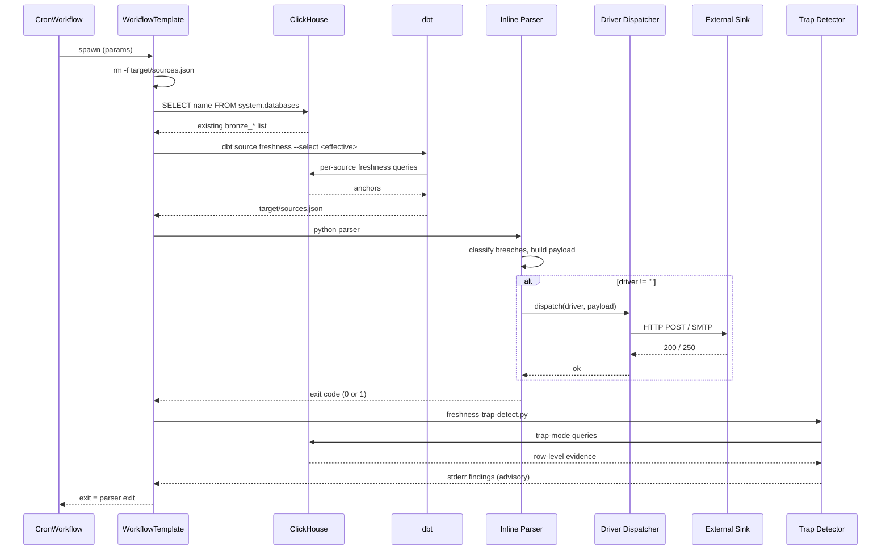
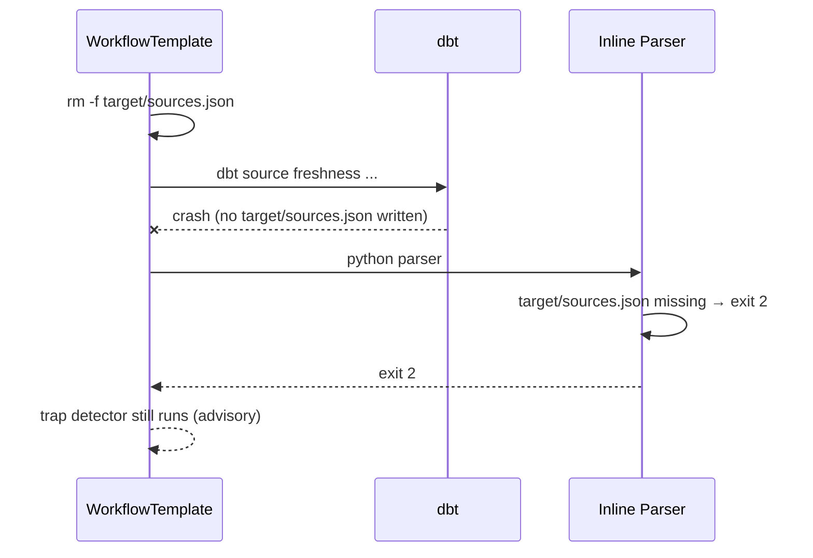
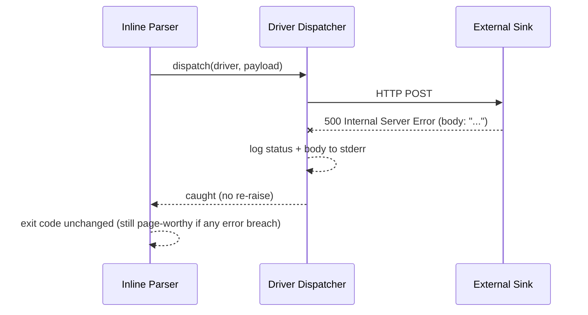

# Technical Design — Ingestion Monitoring

<!-- toc -->

- [1. Architecture Overview](#1-architecture-overview)
  - [1.1 Architectural Vision](#11-architectural-vision)
  - [1.2 Architecture Drivers](#12-architecture-drivers)
  - [1.3 Architecture Layers](#13-architecture-layers)
- [2. Principles & Constraints](#2-principles--constraints)
  - [2.1 Design Principles](#21-design-principles)
  - [2.2 Constraints](#22-constraints)
- [3. Technical Architecture](#3-technical-architecture)
  - [3.1 Domain Model](#31-domain-model)
  - [3.2 Component Model](#32-component-model)
  - [3.3 API Contracts](#33-api-contracts)
  - [3.4 Internal Dependencies](#34-internal-dependencies)
  - [3.5 External Dependencies](#35-external-dependencies)
  - [3.6 Interactions & Sequences](#36-interactions--sequences)
  - [3.7 Database schemas & tables](#37-database-schemas--tables)
  - [3.8 Deployment Topology](#38-deployment-topology)
- [4. Additional context](#4-additional-context)
  - [4.1 Why two report tiers (`report`, `report_extended`) instead of one](#41-why-two-report-tiers-report-reportextended-instead-of-one)
  - [4.2 Why `_airbyte_extracted_at` for streaming and a business date for re-emit](#42-why-airbyteextractedat-for-streaming-and-a-business-date-for-re-emit)
  - [4.3 Why per-driver subblocks instead of a flat `notification.url`](#43-why-per-driver-subblocks-instead-of-a-flat-notificationurl)
  - [4.4 Why the Zulip dispatcher silently rewrites the endpoint](#44-why-the-zulip-dispatcher-silently-rewrites-the-endpoint)
  - [4.5 Why narrow the selector at runtime](#45-why-narrow-the-selector-at-runtime)
  - [4.6 Why the trap detector is advisory](#46-why-the-trap-detector-is-advisory)
  - [4.7 Why `meta.freshness_optout_reason` is mandatory](#47-why-metafreshnessoptoutreason-is-mandatory)
- [5. Traceability](#5-traceability)

<!-- /toc -->

## 1. Architecture Overview

### 1.1 Architectural Vision

Ingestion Monitoring is a single daily-cadence Argo `CronWorkflow`
(`dbt-source-freshness-check`) that delegates to one stateless
`WorkflowTemplate` (`dbt-source-freshness`). The template runs `dbt
source freshness` against ClickHouse, parses `target/sources.json` with
an inline Python step, and dispatches breaches to one of five
notification drivers (webhook / zulip / slack / teams / email). Two
scripts sit at the edges: a CI lint that prevents bad anchors from
landing, and a runtime trap detector that flags re-emit patterns the
freshness check itself cannot see.

The design's defining property is **everything is config-driven from a
single Helm block** (`ingestion.freshness.*` in
[`charts/insight/values.yaml`](../../../../charts/insight/values.yaml)).
Adding a connector is a `schema.yml` edit; switching notification
channels is a `values.yaml` edit; tuning thresholds is a `values.yaml`
edit. No Rust services, no extra Deployments, no per-connector pipeline
plumbing.

The second defining property is **credential isolation by
construction**. The driver's URL or SMTP password is bound to the pod's
env from a `secretKeyRef` resolved server-side by Argo; the rendered
manifest, the Argo UI, and the workflow-controller logs only ever see
the Secret reference, never the raw value
([`charts/insight/templates/ingestion/dbt-source-freshness.yaml:161-194`](../../../../charts/insight/templates/ingestion/dbt-source-freshness.yaml)).

### 1.2 Architecture Drivers

#### Functional Drivers

| PRD Requirement | Design Response |
|---|---|
| `cpt-insightspec-fr-mon-daily-cronworkflow` | Argo `CronWorkflow` `dbt-source-freshness-check`, one daily run at the Helm-configured cron. |
| `cpt-insightspec-fr-mon-selector-narrowing` | Pre-step queries `system.databases`, builds the effective dbt selector. |
| `cpt-insightspec-fr-mon-stale-report-cleanup` | `rm -f target/sources.json` before every dbt invocation. |
| `cpt-insightspec-fr-mon-exit-rederivation` | Inline Python parser re-derives outcome from `target/sources.json`; dbt's exit code is swallowed. |
| `cpt-insightspec-fr-mon-thresholds-sot` | Helm `ingestion.freshness.thresholds.*` → workflow params → `FRESHNESS_*_H` env → dbt `env_var(...)`. |
| `cpt-insightspec-fr-mon-four-tiers` | dbt project-level `+freshness` plus per-source `freshness:` blocks selecting `default` / `event` / `report` / `report_extended`. |
| `cpt-insightspec-fr-mon-tier-assignment` | Tier choice lives in connector `schema.yml`; Helm only tunes tier values. |
| `cpt-insightspec-fr-mon-optout-pertable` | Per-table `freshness: null` in `schema.yml`. |
| `cpt-insightspec-fr-mon-optout-rationale` | `lint-bronze-freshness.py` enforces `meta.freshness_optout_reason`. |
| `cpt-insightspec-fr-mon-mandatory-anchor` | `lint-bronze-freshness.py` enforces a reachable `loaded_at_field`. |
| `cpt-insightspec-fr-mon-trap-post-parser` | Workflow runs `freshness-trap-detect.py` after the parser, advisory-only. |
| `cpt-insightspec-fr-mon-trap-two-modes` | Heuristic full-reemit + opt-in business-date divergence in the same script. |
| `cpt-insightspec-fr-mon-trap-skip-annotation` | `meta.bronze_freshness_trap_check: skip` honoured by detector. |
| `cpt-insightspec-fr-mon-trap-advisory` | Detector exit only writes a notice; freshness parser owns the page-worthy verdict. |
| `cpt-insightspec-fr-mon-driver-selection` | `notification.driver` enum validated by `values.schema.json`. |
| `cpt-insightspec-fr-mon-credential-isolation` | Per-driver `secretKeyRef` branches in the workflow template. |
| `cpt-insightspec-fr-mon-dispatch-impl` | `dispatchers` dict in the inline parser. |
| `cpt-insightspec-fr-mon-delivery-failure-isolation` | `try/except` around dispatch; primary exit code untouched. |
| `cpt-insightspec-fr-mon-identity-helm` | `cluster` / `tenant` Helm values → `CLUSTER` / `TENANT` env vars. |
| `cpt-insightspec-fr-mon-identity-summary` | Summary prefix builder drops empty labels. |
| `cpt-insightspec-fr-mon-identity-payload` | `cluster` / `tenant` written as raw JSON keys. |

#### NFR Allocation

| NFR | Component(s) | Verification |
|---|---|---|
| `cpt-insightspec-nfr-mon-idempotency` | Inline parser + workflow template (no persistent state) | Re-run; verify identical exit + payload. |
| `cpt-insightspec-nfr-mon-daily-cadence` | `CronWorkflow.schedule` | Inspect rendered CronWorkflow; manual ad-hoc submission still works. |
| `cpt-insightspec-nfr-mon-credential-isolation` | `secretKeyRef` branches in workflow template | `kubectl get workflowtemplate ... -o yaml` carries no raw URLs/passwords. |
| `cpt-insightspec-nfr-mon-exit-codes` | Inline parser exit logic | Inject fixtures; assert exits 0 / 1 / 2. |
| `cpt-insightspec-nfr-mon-ci-gated` | `lint-bronze-freshness.py` in CI | Open PR with bad `schema.yml`; CI fails. |
| `cpt-insightspec-nfr-mon-trap-advisory-mode` | Trap detector exit handling | Force trap finding; verify primary exit code unchanged. |
| `cpt-insightspec-nfr-mon-activation-deadline` | `WorkflowTemplate.activeDeadlineSeconds: 1200` | Inspect rendered template. |
| `cpt-insightspec-nfr-mon-empty-sentinel` | Inline parser `1970-01-01` detection | Empty bronze table fixture; verify `(table is empty)` line. |

### 1.3 Architecture Layers

```
ingestion.freshness.* (charts/insight/values.yaml)
        │
        ▼
CronWorkflow.spec.workflowSpec parameters
(charts/insight/templates/ingestion/dbt-source-freshness.yaml:583-662)
        │
        ▼
WorkflowTemplate inputs.parameters → env vars + secretKeyRef
(.yaml:34-212)
        │
        ▼
dbt source freshness  ─►  target/sources.json
(env_var(...) reads FRESHNESS_*_H)
        │
        ▼
Inline Python parser (.yaml:317-562)
        │      │
        │      └─► driver dispatcher (webhook / zulip / slack / teams / email)
        │              │
        │              └─► external sink (Zulip / Slack / Teams / SMTP / generic)
        ▼
freshness-trap-detect.py (advisory)
(src/ingestion/scripts/freshness-trap-detect.py)
```

## 2. Principles & Constraints

### 2.1 Design Principles

#### Advisory failure mode for traps

- [ ] `p1` - **ID**: `cpt-insightspec-principle-mon-trap-advisory`

The trap detector logs but never overrides the freshness parser's exit
code (workflow template lines 575–579). Page-worthy decisions belong to
one place — making heuristic checks page-worthy would erode trust in
the whole monitoring domain.

#### Log loud on failure

- [ ] `p1` - **ID**: `cpt-insightspec-principle-mon-log-loud`

Notification HTTP errors surface the upstream's body (workflow template
lines 421–432) — the `Python-urllib` default exposes only the status
line, which hides Zulip / Slack / Teams JSON error payloads. Loud logs
are the difference between "fix in 5 min" and "fix in 5 hours".

#### Scope freshness to what's collected

- [ ] `p1` - **ID**: `cpt-insightspec-principle-mon-scope-collected`

Selector is narrowed from `source:*` to `bronze_*` databases that
exist in `system.databases` (lines 262–297); a tenant that didn't
deploy OpenAI doesn't see phantom OpenAI ERRORs. Deployment health is
the deployment-health workstream
([#272](https://github.com/cyberfabric/insight/issues/272)), not this
domain.

#### Vendor-documented thresholds, not gut feeling

- [ ] `p1` - **ID**: `cpt-insightspec-principle-mon-vendor-thresholds`

Each tier's warn / error pair sits at the upper edge of the vendor's
documented normal cadence (M365 24–48 h → warn 48 h; Slack ~3 d →
warn 72 h). Documented in `values.yaml` lines 156–183. Re-tiering
requires either a vendor change or evidence from a multi-week
observation window.

### 2.2 Constraints

#### dbt-clickhouse needs explicit `loaded_at_field`

- [ ] `p1` - **ID**: `cpt-insightspec-constraint-mon-explicit-anchor`

The dbt-clickhouse adapter does not support metadata-based freshness;
a missing field → `runtime error`. `+loaded_at_field` at project level
is silently ignored (`loaded_at_field` is a *property*, not a config).
Hence the per-source declaration and the lint that enforces it.

#### `+freshness` propagates from project level

- [ ] `p1` - **ID**: `cpt-insightspec-constraint-mon-freshness-propagates`

The project-level `+freshness` block in `dbt_project.yml:71-79` is
inherited by every source; per-source `freshness:` blocks override it.
Tier selection therefore lives in `schema.yml`, not in the project
config.

#### Zulip's `/external/json` is not a markdown sender

- [ ] `p1` - **ID**: `cpt-insightspec-constraint-mon-zulip-endpoint`

`/api/v1/external/json` dumps the request body as a JSON code block.
The Slack-compatible endpoint (`/api/v1/external/slack`) renders
Slack-style markdown. The dispatcher silently rewrites the path so an
operator who pasted the JSON URL still gets formatted output (workflow
template lines 445–478).

#### Cloudflare-managed receivers reject the default UA

- [ ] `p2` - **ID**: `cpt-insightspec-constraint-mon-explicit-ua`

A bare `Python-urllib/3.x` looks like a bot. The dispatcher sets an
explicit `User-Agent: insight-freshness-monitor/1.0` (workflow
template line 416).

#### Empty table sentinel must not read as 500 000 h lag

- [ ] `p1` - **ID**: `cpt-insightspec-constraint-mon-empty-sentinel`

`MAX(<col>)` over zero rows is `NULL`. dbt-clickhouse serialises it as
the Unix epoch with an enormous `age_in_s`, which reads as ~500 000 h
of lag. The parser detects the sentinel
(`max_loaded_at.startswith("1970-01-01")`) and surfaces "table is
empty (no rows ingested)" instead (workflow template lines 348–360).

## 3. Technical Architecture

### 3.1 Domain Model

| Concept | Where it's defined |
|---|---|
| **Bronze source** | `sources:` entry in any connector's `dbt/schema.yml`; identified by `name: bronze_*` or `schema: bronze_*` (lint matches both — see `lint-bronze-freshness.py:69-73`). |
| **Freshness anchor** | `loaded_at_field` property at source or table level. Two valid forms: `_airbyte_extracted_at` (streaming) or a business-date expression (`parseDateTimeBestEffortOrNull(...)`, `parseDateTime64BestEffortOrNull(..., 3)`, `fromUnixTimestamp64Milli(...)`). |
| **Opt-out** | Per-table `freshness: null` plus mandatory `meta.freshness_optout_reason: "<rationale>"` (lint at `lint-bronze-freshness.py:88-97`). |
| **SLA tier** | One of `default`, `event`, `report`, `report_extended`; chosen by the connector's source-level `freshness:` block referencing a tier-specific env var. |
| **Breach** | A row in the parser's `breaches` list: `{source, status, max_loaded_at, age_hours, empty}` (workflow template lines 352–360). |
| **Trap suspect** | A finding from the trap detector: `kind ∈ {full-reemit, incremental-topup}` plus row-level evidence (`freshness-trap-detect.py:186-227`). |
| **Driver** | A parser dispatch arm + Helm subblock + workflow-yaml `secretKeyRef` branch. Five today (`webhook`, `zulip`, `slack`, `teams`, `email`); `""` = log-only. |

### 3.2 Component Model

#### Workflow Template (`dbt-source-freshness`)

- [ ] `p1` - **ID**: `cpt-insightspec-component-mon-workflow-template`

##### Why this component exists

Provides the stateless Argo `WorkflowTemplate` that any caller
(scheduled or ad-hoc) can invoke with a single set of parameters.
Centralises the dbt invocation, parser, dispatcher, and trap detector
so that switching tenants or drivers does not duplicate workflow
plumbing.

##### Responsibility scope

- Accept every per-deployment parameter via `inputs.parameters`
  (charts/insight/templates/ingestion/dbt-source-freshness.yaml:34-106).
- Bind credentials via `secretKeyRef` only when the matching driver is
  configured (lines 161–194).
- Run `dbt source freshness` with the effective selector (lines
  254–307).
- Hand off to the inline parser, then the trap detector, with the
  shell wrapper preserving the parser's exit code (lines 561–581).

##### Responsibility boundaries

- Does NOT decide *when* to run — that is the `CronWorkflow`'s job.
- Does NOT own credential storage — Kubernetes Secrets do.
- Does NOT classify breaches — the inline parser does (see
  `cpt-insightspec-component-mon-parser`).

##### Related components (by ID)

- `cpt-insightspec-component-mon-cronworkflow` — schedules this template.
- `cpt-insightspec-component-mon-parser` — invoked inline.
- `cpt-insightspec-component-mon-trap-detector` — invoked after the parser.
- `cpt-insightspec-component-mon-helm-surface` — supplies parameters.

#### CronWorkflow (`dbt-source-freshness-check`)

- [ ] `p1` - **ID**: `cpt-insightspec-component-mon-cronworkflow`

##### Why this component exists

Wraps the workflow template with a daily schedule and feeds Helm values
into its parameters. Argo handles cron parsing, missed-fire policy,
and `failedJobsHistoryLimit` retention.

##### Responsibility scope

- `spec.schedule` from `ingestion.freshness.schedule`.
- `spec.workflowSpec` parameters from the Helm block (lines 583–662).
- Default `concurrencyPolicy: Forbid` so a long run cannot be doubled.

##### Responsibility boundaries

- Does NOT execute logic itself — it only delegates to the
  `WorkflowTemplate`.
- Does NOT carry credentials or notification config beyond what the
  template parameters require.

##### Related components (by ID)

- `cpt-insightspec-component-mon-workflow-template` — the delegate.
- `cpt-insightspec-component-mon-helm-surface` — Helm values it
  flattens into parameters.

#### Inline Freshness Parser

- [ ] `p1` - **ID**: `cpt-insightspec-component-mon-parser`

##### Why this component exists

dbt's exit code does not distinguish PASS / WARN / ERROR / RUNTIME
ERROR; we need a deterministic verdict. The parser reads
`target/sources.json` and computes the canonical breach list and exit
code that the dispatcher uses.

##### Responsibility scope

- Read `target/sources.json`; if missing, exit 2 (line 323).
- Classify each source as `pass` / `warn` / `error` / `runtime error`.
- Detect the empty-table sentinel and emit `(table is empty)` instead
  of ~500 000 h lag (lines 348–360).
- Build the canonical breach record `{source, status, max_loaded_at,
  age_hours, empty}`.
- Decide page vs no-page (`sys.exit(1)` if any breach is `error` or
  `runtime error`, else `0`; line 559).
- Call the dispatcher when a driver is configured.

##### Responsibility boundaries

- Does NOT run dbt itself.
- Does NOT format driver-specific payloads — that is the dispatcher's
  job.
- Does NOT write any state to disk other than the dbt-produced
  `target/sources.json` (already there).

##### Related components (by ID)

- `cpt-insightspec-component-mon-workflow-template` — invokes it.
- `cpt-insightspec-component-mon-driver-dispatcher` — invoked from inside
  the parser.
- `cpt-insightspec-component-mon-trap-detector` — runs after.

#### Driver Dispatcher

- [ ] `p1` - **ID**: `cpt-insightspec-component-mon-driver-dispatcher`

##### Why this component exists

Different sinks (Zulip, Slack, Teams, SMTP, generic webhook) need
different payload shapes, content types, and quirks. A single
dispatcher dict (workflow template lines 533–539) keeps the parser
simple and makes adding a new driver a one-arm change.

##### Responsibility scope

- Map driver name → format function → `_post`/SMTP transport.
- Set `User-Agent: insight-freshness-monitor/1.0` (line 416).
- Surface upstream HTTP body on `HTTPError` (lines 421–432).
- Rewrite Zulip's `/external/json` → `/external/slack` for the Zulip
  driver (line 457).
- Catch and log every dispatch failure without changing the workflow's
  primary exit code (lines 550–554).

##### Responsibility boundaries

- Does NOT classify breaches.
- Does NOT decide whether to dispatch — the parser does.
- Does NOT manage Secret content; only consumes env vars bound from
  Secrets.

##### Related components (by ID)

- `cpt-insightspec-component-mon-parser` — caller.
- `cpt-insightspec-component-mon-helm-surface` — driver enum + per-driver
  Helm subblocks.

#### Trap Detector

- [ ] `p1` - **ID**: `cpt-insightspec-component-mon-trap-detector`

##### Why this component exists

The freshness check on `_airbyte_extracted_at` is fooled by re-emit /
incremental-topup patterns. A second, independent script flags those
suspects so authors and operators see them — without overriding the
freshness verdict.

##### Responsibility scope

- Mode 1 (heuristic full-reemit): ≥ 95 % rows within last 30 h, ≤ 2
  distinct extract days, ≥ 100 rows
  (`freshness-trap-detect.py:188-200`).
- Mode 2 (opt-in business-date divergence): compare
  `MAX(<bronze_business_date_col>)` to `MAX(_airbyte_extracted_at)`;
  flag ≥ 24 h gap (lines 202–227).
- Honour `meta.bronze_freshness_trap_check: skip` per source/table.
- Print finding lists to stdout; per-table query failures and bootstrap
  errors go to stderr. Exit code is captured by the workflow but not
  used to override the parser's verdict.

##### Responsibility boundaries

- Does NOT page anyone.
- Does NOT mutate ClickHouse data.
- Does NOT read driver Helm config.

##### Related components (by ID)

- `cpt-insightspec-component-mon-workflow-template` — invokes it after the
  parser.
- `cpt-insightspec-component-mon-parser` — its verdict is preserved.

#### CI Lint

- [ ] `p1` - **ID**: `cpt-insightspec-component-mon-ci-lint`

##### Why this component exists

Bad `schema.yml` (missing `loaded_at_field`, opt-out without rationale)
should fail at PR time, not at runtime in production. The lint catches
both classes locally and in CI.

##### Responsibility scope

- Walk `src/ingestion/connectors/*/dbt/schema.yml`.
- Reject any `bronze_*` source without a reachable
  `loaded_at_field` (`lint-bronze-freshness.py:69-73`).
- Reject any `freshness: null` opt-out without
  `meta.freshness_optout_reason` (lines 88–97).
- Exit 0 on success, non-zero with structured diagnostics on failure.

##### Responsibility boundaries

- Does NOT run dbt or ClickHouse.
- Does NOT enforce tier choice — only that *some* anchor is reachable.

##### Related components (by ID)

- `cpt-insightspec-component-mon-workflow-template` — runtime counterpart
  for runtime checks.

#### Threshold Env-Var Layer

- [ ] `p1` - **ID**: `cpt-insightspec-component-mon-threshold-env`

##### Why this component exists

Helm needs to be the single source of truth for tier values without
dbt needing to know about Helm. Env vars are the contract layer:
workflow template exports `FRESHNESS_*_H`, dbt reads them via
`env_var(...)` in `dbt_project.yml` and per-connector `schema.yml`.

##### Responsibility scope

- Map every Helm `thresholds.*` value to a workflow parameter.
- Export the parameter as a `FRESHNESS_*_H` env var inside the toolbox
  pod (workflow template lines 197–212).
- Provide a literal default in every `env_var('FRESHNESS_*_H', 'NN')`
  call so dbt still works when the env is unset (e.g. local
  invocations).

##### Responsibility boundaries

- Does NOT decide which source uses which tier — that is in
  `schema.yml`.
- Does NOT validate threshold values — `values.schema.json` does.

##### Related components (by ID)

- `cpt-insightspec-component-mon-helm-surface` — provides values.
- `cpt-insightspec-component-mon-workflow-template` — exports env vars.

#### Helm Surface

- [ ] `p1` - **ID**: `cpt-insightspec-component-mon-helm-surface`

##### Why this component exists

Operators need a single tunable surface. `ingestion.freshness.*` in
`values.yaml` is the documented configuration entrypoint;
`values.schema.json` validates it.

##### Responsibility scope

- `ingestion.freshness.{enabled,schedule,dbtSelect,cluster,tenant}`
  top-level keys.
- `ingestion.freshness.thresholds.*` block (8 fields, four tiers).
- `ingestion.freshness.notification.{driver, webhook, zulip, slack,
  teams, email}` per-driver subblocks with `urlSecret` references.
- `values.schema.json` enforces the driver enum (line 37) and the
  shape of each subblock.

##### Responsibility boundaries

- Does NOT carry credentials directly — only `secretKeyRef` pointers.
- Does NOT decide tier choice for connectors.

##### Related components (by ID)

- `cpt-insightspec-component-mon-cronworkflow` — flattens this into
  parameters.
- `cpt-insightspec-component-mon-threshold-env` — reads thresholds.
- `cpt-insightspec-component-mon-driver-dispatcher` — reads driver
  selection.

### 3.3 API Contracts

The driver dispatcher is the `dispatchers` dict at workflow template
lines 533–539. Common preamble: every dispatch goes through `_post`
(lines 412–432), which sets `User-Agent: insight-freshness-monitor/1.0`
and surfaces the upstream's response body on `HTTPError`.

#### 3.3.1 `webhook`

- Endpoint: whatever is in `NOTIFICATION_URL` (verbatim).
- Body shape (workflow template lines 434–443):

```json
{
  "topic": "ingestion-freshness",
  "cluster": "<cluster-or-empty>",
  "tenant": "<tenant-or-empty>",
  "summary": "[cluster=…, tenant=…] N bronze source(s) breaching freshness SLA",
  "breaches": [
    {
      "source": "source.ingestion.bronze_jira.jira_issue",
      "status": "error",
      "max_loaded_at": "2026-04-28T03:14:21Z",
      "age_hours": 51.2,
      "empty": false
    }
  ]
}
```

- Header: `Content-Type: application/json`.
- Secret binding:
  `ingestion.freshness.notification.webhook.urlSecret.{name,key}`
  (default `key: url`), workflow YAML lines 162–167.

#### 3.3.2 `zulip`

- Endpoint: `NOTIFICATION_URL` with the path `/api/v1/external/json`
  rewritten to `/api/v1/external/slack` (line 457). The two paths are
  different Zulip integrations — `/external/json` dumps the body as a
  JSON code block (debugging integration); `/external/slack` is the
  Slack-compatible incoming webhook that renders Slack mrkdwn.
  Operators who pasted the JSON URL still get a formatted message.
- Routing: `stream` and `topic` from `NOTIFICATION_ZULIP_STREAM` /
  `NOTIFICATION_ZULIP_TOPIC` are URL-encoded and appended to the query
  string (lines 458–462).
- Body: `application/x-www-form-urlencoded` carrying
  `user_name=ingestion-freshness`, `channel_name=freshness`,
  `text=<slack-mrkdwn>` — the Slack-compatible webhook expects these
  legacy-Slack form fields (lines 472–478).
- Markdown: single `*` for bold (Slack mrkdwn), bullet `•` (line 466).
- Secret binding:
  `ingestion.freshness.notification.zulip.urlSecret.{name,key}`
  (workflow YAML lines 168–173).
- Quirk: Zulip stream names can include trailing zero-width-space
  U+200B; `values.yaml:243-249` warns operators to copy from Zulip's
  UI rather than retype.

#### 3.3.3 `slack`

- Endpoint: `NOTIFICATION_URL` (Slack incoming-webhook URL).
- Body: `application/json` with `{"text": "<markdown>"}`, optionally
  `channel: <override>` if `NOTIFICATION_SLACK_CHANNEL` is set and
  workspace policy allows it (lines 480–487).
- Secret binding:
  `ingestion.freshness.notification.slack.urlSecret.{name,key}`
  (workflow YAML lines 174–179).

#### 3.3.4 `teams`

- Endpoint: `NOTIFICATION_URL` (Microsoft Teams incoming webhook).
- Body: `application/json`, `MessageCard` schema (lines 489–500).
  `themeColor` is `FF0000` (red) when any breach is page-worthy,
  `FFA500` (orange) otherwise.
- No channel override — Teams binds the URL to a single channel at
  creation.
- Secret binding:
  `ingestion.freshness.notification.teams.urlSecret.{name,key}`
  (workflow YAML lines 180–185).

#### 3.3.5 `email`

- Transport: `smtplib` from the standard library (no extra deps).
  `SMTP_SSL` when port=465, otherwise plain `SMTP` with optional
  `STARTTLS` (lines 502–531).
- Required Helm values: `notification.email.smtp.host`,
  `notification.email.from`, `notification.email.to`. The dispatcher
  raises `RuntimeError` if any is missing (lines 513–517).
- Subject: `<prefix> <summary>` when prefix is non-empty.
- Recipients: comma-separated `NOTIFICATION_EMAIL_TO` split on `,`,
  whitespace-stripped.
- Secret binding:
  `ingestion.freshness.notification.email.smtp.passwordSecret.{name,key}`
  (workflow YAML lines 187–193, rendered only when
  `$n.email.smtp.passwordSecret.name` is set).

### 3.4 Internal Dependencies

| From | To | Mechanism |
|---|---|---|
| CronWorkflow | WorkflowTemplate | Argo `templateRef` (same namespace). |
| WorkflowTemplate | dbt-clickhouse | Container exec inside `insight-toolbox`. |
| WorkflowTemplate | ClickHouse | dbt profile points at CH HTTP endpoint. |
| WorkflowTemplate | Trap detector | Container exec inside `insight-toolbox` after parser. |
| Trap detector | ClickHouse | HTTP queries on port 8123. |
| Inline parser | Driver dispatcher | In-process Python call. |
| Driver dispatcher | Kubernetes Secret | `secretKeyRef` env binding (server-side resolution). |

### 3.5 External Dependencies

#### Argo Workflows controller

Provides `WorkflowTemplate` / `CronWorkflow` reconciliation. Argo is
**not** a chart dependency of the umbrella — operators install it out
of band (see [`scripts/install-argo.sh`](../../../../scripts/install-argo.sh)
referenced in `charts/insight/Chart.yaml`'s preamble). Tested against
v3.5.10 and v3.6.x; minimum CRDs needed are `workflows.argoproj.io`,
`workflowtemplates.argoproj.io`, and `cronworkflows.argoproj.io`.

#### dbt-clickhouse adapter

Bundled in `insight-toolbox`. Required because the adapter does not
support metadata-based freshness — `loaded_at_field` is the only
supported anchor expression.

#### ClickHouse

Provides `system.databases` for selector narrowing and the HTTP
endpoint used by the trap detector.

#### Kubernetes Secret store

`secretKeyRef` resolution for `clickhouse.passwordSecret` and the
active driver's URL / SMTP password Secret.

#### Notification receivers

Zulip / Slack / Microsoft Teams incoming-webhook endpoints, or any
generic JSON webhook, or an SMTP relay. Treated as black-box; their
uptime is out of this domain's NFR scope.

### 3.6 Interactions & Sequences

#### Daily freshness happy path

**ID**: `cpt-insightspec-seq-mon-happy-path`



#### Failure path: dbt crash

**ID**: `cpt-insightspec-seq-mon-dbt-crash`



#### Failure path: notification delivery error

**ID**: `cpt-insightspec-seq-mon-delivery-error`



### 3.7 Database schemas & tables

#### `target/sources.json` (dbt artefact)

This is not a ClickHouse table; it is the dbt-produced JSON artefact
that the parser consumes. Shape (subset):

| Path | Type | Purpose |
|---|---|---|
| `results[i].unique_id` | string | dbt source unique id (`source.ingestion.bronze_*.<table>`). |
| `results[i].status` | enum | `pass` / `warn` / `error` / `runtime error`. |
| `results[i].max_loaded_at` | string | ISO-8601 of `MAX(<anchor>)` (or `1970-01-01T...` sentinel for empty tables). |
| `results[i].max_loaded_at_time_ago_in_s` | number | Seconds since the anchor (parser converts to hours). |
| `results[i].criteria.{warn_after,error_after}` | object | The active tier values for this source. |

#### ClickHouse `system.databases` (read-only system table)

Used by the workflow's selector-narrowing step to enumerate which
`bronze_*` databases actually exist on this deployment. No writes.

#### ClickHouse `bronze_<connector>.<stream>` (bronze tables)

The freshness check reads `MAX(<loaded_at_field>)` and `count()` from
each declared bronze source. The trap detector additionally reads
`_airbyte_extracted_at` distribution and the optional
`<bronze_business_date_col>` column. No writes from this domain.

### 3.8 Deployment Topology

#### Argo namespace

The `WorkflowTemplate`, `CronWorkflow`, and the workflow pods live in
the `argo` namespace. The `insight-toolbox` image carries dbt,
dbt-clickhouse, and the freshness scripts.

#### Secret access

Driver Secrets and `clickhouse.passwordSecret` live in the same
namespace as the workflow pods so `secretKeyRef` resolves
namespace-locally. Cross-namespace Secret access is out of scope.

#### Kind / prod parity

Local Kind clusters use the same Helm chart + values as production —
the only differences are the per-deployment `cluster` / `tenant`
labels and the driver selection (typically `""` locally, an actual
driver in production). This keeps the dev/prod-parity NFR honest.

| Helm path | Type | Default | Purpose |
|---|---|---|---|
| `ingestion.freshness.enabled` | bool | `true` | Top-level kill switch. |
| `ingestion.freshness.schedule` | string | `"0 13 * * *"` | Cron — sits past every connector sync window (02:00–11:00 UTC) plus 2 h grace. |
| `ingestion.freshness.dbtSelect` | string | `"source:*"` | Default selector. Narrowed at runtime to deployed bronze databases. |
| `ingestion.freshness.cluster` | string | `""` | Identity label — installation tier. |
| `ingestion.freshness.tenant` | string | `""` | Identity label — customer / workspace. |
| `ingestion.freshness.thresholds.defaultWarnHours` | int | `30` | "default" tier warn. |
| `ingestion.freshness.thresholds.defaultErrorHours` | int | `48` | "default" tier error. |
| `ingestion.freshness.thresholds.eventWarnHours` | int | `72` | "event" tier warn. |
| `ingestion.freshness.thresholds.eventErrorHours` | int | `96` | "event" tier error. |
| `ingestion.freshness.thresholds.reportWarnHours` | int | `48` | "report" tier warn. |
| `ingestion.freshness.thresholds.reportErrorHours` | int | `96` | "report" tier error. |
| `ingestion.freshness.thresholds.reportExtendedWarnHours` | int | `72` | "report_extended" tier warn. |
| `ingestion.freshness.thresholds.reportExtendedErrorHours` | int | `120` | "report_extended" tier error. |
| `ingestion.freshness.notification.driver` | enum | `""` | One of `""`, `webhook`, `zulip`, `slack`, `teams`, `email`. Schema-validated. |
| `ingestion.freshness.notification.webhook.urlSecret.{name,key}` | secretRef | — | Required when driver=webhook. |
| `ingestion.freshness.notification.zulip.urlSecret.{name,key}` | secretRef | — | Required when driver=zulip. |
| `ingestion.freshness.notification.zulip.stream` | string | `""` | Optional override; else inherits from URL query. |
| `ingestion.freshness.notification.zulip.topic` | string | `""` | Optional override. |
| `ingestion.freshness.notification.slack.urlSecret.{name,key}` | secretRef | — | Required when driver=slack. |
| `ingestion.freshness.notification.slack.channel` | string | `""` | Optional channel override. |
| `ingestion.freshness.notification.teams.urlSecret.{name,key}` | secretRef | — | Required when driver=teams. |
| `ingestion.freshness.notification.email.smtp.host` | string | `""` | Required when driver=email. |
| `ingestion.freshness.notification.email.smtp.port` | int | `587` | 587 STARTTLS / 465 SMTPS / 25 plain. |
| `ingestion.freshness.notification.email.smtp.username` | string | `""` | Optional SMTP AUTH user. |
| `ingestion.freshness.notification.email.smtp.passwordSecret.{name,key}` | secretRef | — | SMTP AUTH password (rendered only when set). |
| `ingestion.freshness.notification.email.smtp.starttls` | bool | `true` | Ignored when port=465. |
| `ingestion.freshness.notification.email.from` | string | `""` | Required when driver=email. |
| `ingestion.freshness.notification.email.to` | string | `""` | Required when driver=email — comma-separated. |
| `ingestion.freshness.notification.email.subjectPrefix` | string | `"[ingestion-freshness]"` | Prefix prepended to `summary`. |

## 4. Additional context

### 4.1 Why two report tiers (`report`, `report_extended`) instead of one

Microsoft Graph reports document a 24–48 h publish lag — sliding the
warn to 48 h is just "the upper edge of stated normal". Slack
admin.analytics is observed and documented to lag ~3 days, with
stretches up to 5 days during Slack maintenance — applying the
report-tier (96 h error) to Slack would page on every Slack
maintenance window. They needed different bands, but lumping every
3-day vendor into "event" would lose the semantic signal that `event`
is for natural quiet days, not for vendor lag.

### 4.2 Why `_airbyte_extracted_at` for streaming and a business date for re-emit

Streaming connectors land rows in bronze approximately when they
happen — `_airbyte_extracted_at` tracks reality. Report-style
connectors re-fetch a fixed window every run: even when the upstream
stops publishing, Airbyte still writes "fresh" rows for older business
days, so `_airbyte_extracted_at` keeps advancing forever. The
`feature-bronze-freshness-sla/FEATURE.md` example (M365 9 h fresh
extracted-at vs 96 h-stale `reportRefreshDate` on 2026-05-04) is the
canonical evidence. Anchoring on the business-date column flips the
verdict to ERROR, which is correct.

### 4.3 Why per-driver subblocks instead of a flat `notification.url`

Different drivers need different *non-credential* settings (Zulip
stream/topic, Slack channel, SMTP host/port/from/to/subjectPrefix). A
flat `notification.url` would force these into either the URL itself
(Zulip's `?stream=...` works; Slack's channel override does not always)
or into an out-of-band lookup table. Per-driver subblocks let each
driver own its shape; the dispatcher just reads the env vars it cares
about. Adding a sixth driver is one Helm subblock + one match arm +
one `secretKeyRef` branch — no other Helm surface changes (workflow
template line 380–382, `values.yaml:195-201`).

### 4.4 Why the Zulip dispatcher silently rewrites the endpoint

Zulip exposes two incoming-webhook integrations under the same UI
("Incoming webhook"): `/api/v1/external/json` (intended for debugging,
dumps body as JSON code block) and `/api/v1/external/slack`
(Slack-compatible, renders mrkdwn). The UI does not warn that the
former is the wrong integration for routine notifications. Rather
than require operators to know the Zulip-internal distinction, the
dispatcher rewrites the path on the way out (workflow template line
457). This is documented in the chart values comment
(`values.yaml:230-239`) and in the dispatcher's docstring (lines
445–478).

### 4.5 Why narrow the selector at runtime

`source:*` against a partial deployment (e.g. a tenant who hasn't
deployed OpenAI) would emit one ERROR per missing source on every run,
flooding on-call with noise about something they deliberately didn't
deploy. Narrowing to `bronze_*` databases that exist in
`system.databases` (workflow template lines 262–297) keeps the check
scoped to "what we collect", and explicitly leaves "what should be
collected" to the deployment-health workstream
([#272](https://github.com/cyberfabric/insight/issues/272)).

### 4.6 Why the trap detector is advisory

The freshness check is the page-worthy signal — its threshold tiers are
documented per source, its semantics are deterministic, its output is
the canonical payload. The trap detector is heuristic — its thresholds
(`SUSPECT_PCT_RECENT = 95.0`, `SUSPECT_MAX_DISTINCT_DAYS = 2`,
`MIN_ROWS = 100`, `RECENT_WINDOW_HOURS = 30`) are hardcoded constants
in [`freshness-trap-detect.py`](../../../../src/ingestion/scripts/freshness-trap-detect.py)
rather than Helm-tunable values, so retuning is a code change with a
PR review attached. False positives on a heuristic that pages on-call
would erode trust in the whole monitoring domain. So the trap detector
logs, the freshness parser owns the verdict (workflow template lines
575–579).

### 4.7 Why `meta.freshness_optout_reason` is mandatory

Bare `freshness: null` is too easy to leave in by accident. Once it
lands, the table is invisible to monitoring forever, with no comment
explaining why. Forcing a one-line rationale at the time of writing
(`lint-bronze-freshness.py:88-97`) keeps the audit surface
grep-friendly: `grep -A1 'freshness: null'` shows what every opt-out
is for.

## 5. Traceability

- Feature spec: [`feature-bronze-freshness-sla/FEATURE.md`](feature-bronze-freshness-sla/FEATURE.md)
- Operator runbook: [`src/ingestion/MONITORING.md`](../../../../src/ingestion/MONITORING.md)
- Implementation files (`feat/bronze-freshness-sla` branch in `dzarlax/insight`):
  - Workflow + parser: [`charts/insight/templates/ingestion/dbt-source-freshness.yaml`](../../../../charts/insight/templates/ingestion/dbt-source-freshness.yaml)
  - Helm surface: [`charts/insight/values.yaml`](../../../../charts/insight/values.yaml) lines 147–292
  - Schema: [`charts/insight/values.schema.json`](../../../../charts/insight/values.schema.json) lines 26–99
  - dbt project freshness defaults: [`src/ingestion/dbt/dbt_project.yml`](../../../../src/ingestion/dbt/dbt_project.yml) lines 70–79
  - CI lint: [`src/ingestion/scripts/lint-bronze-freshness.py`](../../../../src/ingestion/scripts/lint-bronze-freshness.py)
  - Trap detector: [`src/ingestion/scripts/freshness-trap-detect.py`](../../../../src/ingestion/scripts/freshness-trap-detect.py)
  - Per-connector schemas: `src/ingestion/connectors/*/*/dbt/schema.yml`
- Relevant commits on `feat/bronze-freshness-sla`:
  - `542756f` — driver-based notification (replaces flat `notificationWebhookUrl` with per-driver subblocks).
  - `c196fdb` — Zulip render fix (`/external/json` → `/external/slack` rewrite + Slack-compatible form fields), explicit `User-Agent` for Cloudflare-fronted receivers, ZWSP note in Zulip stream values.
  - `23d1b18` — empty-table sentinel (1970-01-01 detection in the parser).
- Future work cross-references:
  - Deployment health — [issue #272](https://github.com/cyberfabric/insight/issues/272).
  - Volume baseline / source-vs-bronze attribution / ownership — "Open work" sections of [`MONITORING.md`](../../../../src/ingestion/MONITORING.md).
